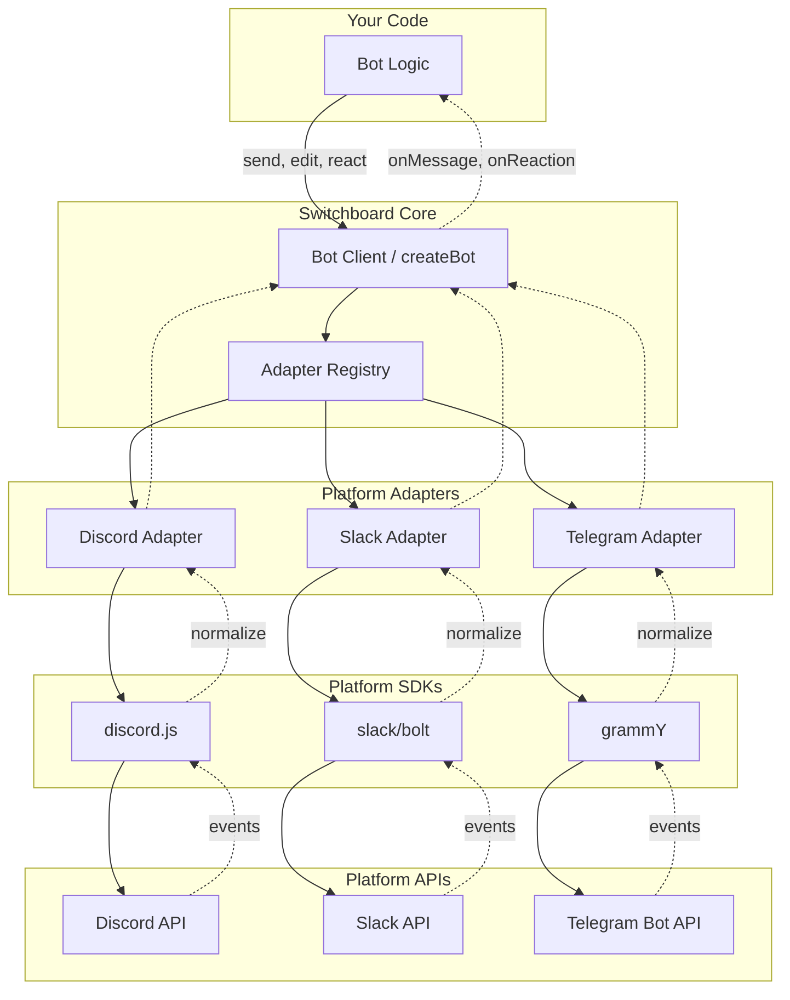

# Switchboard

[](https://www.npmjs.com/package/@aarekaz/switchboard)
[](https://www.npmjs.com/package/@aarekaz/switchboard)
[](LICENSE)
[](https://www.typescriptlang.org/)

**The universal TypeScript SDK for chat bots — write once, deploy to Discord, Slack, and Telegram.**

Switchboard normalizes the differences between chat platforms behind one Bot API, so the same handler code runs on every supported platform. Swap platforms by changing one line. Stream AI responses straight into a message with a single call. Type-safe, ESM-only, zero ceremony.


## Why Switchboard?

- **One API, three platforms.** Discord, Slack, and Telegram share the same `Bot` interface — no per-platform branching in your code.
- **One-line platform swap.** `platform: 'discord'` → `platform: 'slack'` is the entire diff.
- **AI streaming built in.** Pass an `AsyncIterable<string>` (e.g. AI SDK's `result.textStream`) to `bot.reply()` and Switchboard posts a placeholder, then edits the message in place as tokens arrive.
- **`Result<T>` error handling.** Every operation returns `{ ok, value | error }` — no thrown exceptions, no surprise crashes.
- **Tree-shakeable.** Only the adapter you import lands in your bundle. Subpath exports keep `discord.js`, `@slack/bolt`, and `grammy` independent.
- **Strict TypeScript.** `strict: true`, `noUncheckedIndexedAccess`, autocomplete-driven DX.

## Installation

```bash
pnpm add @aarekaz/switchboard
# or
npm install @aarekaz/switchboard
```

## Quick Start

```ts
import { createBot } from '@aarekaz/switchboard';
import '@aarekaz/switchboard/discord';

const bot = createBot({
  platform: 'discord',
  credentials: { token: process.env.DISCORD_TOKEN },
});

bot.onMessage(async (ctx) => {
  if (ctx.text.toLowerCase().includes('ping')) {
    await ctx.reply('pong!');
  }
});

await bot.start();
```

Swap platforms by changing one line:

```ts
// Discord → Slack: change the import and the platform name
import '@aarekaz/switchboard/slack';

const bot = createBot({
  platform: 'slack',
  credentials: {
    botToken: process.env.SLACK_BOT_TOKEN,
    appToken: process.env.SLACK_APP_TOKEN,
  },
});
// ...same handler code as above
```

## Stream AI responses

Pipe any `AsyncIterable<string>` or `ReadableStream<string>` (including AI SDK's `result.textStream`) directly into a reply — Switchboard posts a placeholder and edits the message as tokens arrive.

```ts
import { streamText } from 'ai';
import { anthropic } from '@ai-sdk/anthropic';

bot.onMessage(async (ctx) => {
  const { textStream } = streamText({
    model: anthropic('claude-sonnet-4-6'),
    prompt: ctx.text,
  });

  await ctx.reply(textStream); // posts "...", edits live as tokens arrive
});
```

Tunable cadence and placeholder:

```ts
await ctx.reply(textStream, {
  stream: { updateIntervalMs: 1000, placeholder: 'Thinking…' },
});
```

## How it compares

| | **Switchboard** | **discord.js / @slack/bolt / grammy** | **Vercel Chat SDK** |
|---|---|---|---|
| **Cross-platform API** | ✅ Discord, Slack, Telegram | ❌ Single platform each | ✅ Slack, Teams, Discord, Telegram, +5 more |
| **One-line platform swap** | ✅ | ❌ | ⚠️ Adapter swap |
| **AI streaming into messages** | ✅ Built in | ❌ DIY | ✅ Built in |
| **Error model** | `Result<T>` (no throws) | Throws | Throws |
| **State backend required** | ❌ Zero infra | ❌ | ⚠️ Redis/Postgres recommended |
| **Bundle footprint** | Lean — adapter-scoped | Lean | Heavier (cards, modals, state) |
| **JSX cards / modals / slash commands** | ❌ Not yet | Platform-specific | ✅ |
| **Bring-your-own AI SDK** | ✅ AI SDK, OpenAI SDK, anything | ✅ | Optimized for AI SDK |
| **Best for** | Lightweight bots, BYO AI, infra-free deploys | Single-platform native power-users | Production agents with rich UI |

## Examples

- [`examples/hello-world/one-line-swap.ts`](examples/hello-world/one-line-swap.ts) — runtime platform switch
- [`examples/hello-world/discord.ts`](examples/hello-world/discord.ts), [`slack.ts`](examples/hello-world/slack.ts), [`telegram.ts`](examples/hello-world/telegram.ts) — per-platform setups
- [`examples/hello-world/dx-comparison.ts`](examples/hello-world/dx-comparison.ts) — Switchboard vs raw platform SDKs

## Architecture



**Solid arrows** = outbound (your bot sending messages, reactions, edits)
**Dashed arrows** = inbound (platform events flowing up to your handlers)

The **One Line Swap** works because your code only talks to the Bot Client. Changing `import '@aarekaz/switchboard/discord'` to `import '@aarekaz/switchboard/telegram'` swaps the entire adapter layer underneath — your bot logic stays identical.

## Design Philosophy

**"Pit of Success"** - Make the right thing the easiest thing.

1. **Platforms are implementation details** - Your bot logic should be platform-agnostic
2. **One Line Swap** - Switching platforms should require changing exactly one line
3. **Progressive Disclosure** - Start simple (90% use cases), add power when needed (10% use cases)
4. **Type Safety as a Feature** - Full TypeScript support without manual type annotations
