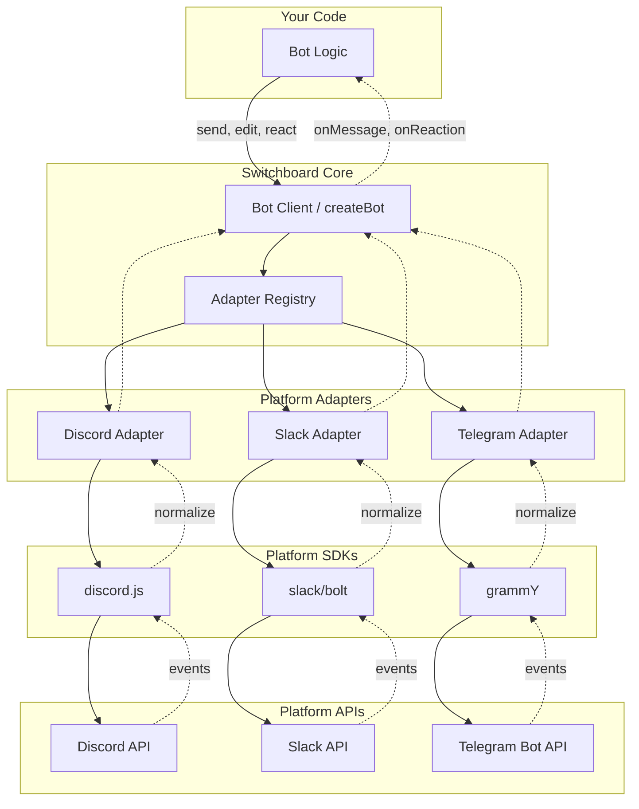

# Switchboard (v0.3.5)

**Build chat bots once, deploy everywhere.**

Switchboard is a universal SDK for chat platforms that enables developers to build bots once and deploy them seamlessly across Discord, Slack, and Telegram.


## Installation

```bash
pnpm add @aarekaz/switchboard
```

## Quick Start

```ts
import { createBot } from '@aarekaz/switchboard';
import '@aarekaz/switchboard/discord';

const bot = createBot({
  token: process.env.DISCORD_TOKEN,
  platform: 'discord',
});
```

Swap platforms by changing one line:

```ts
import '@aarekaz/switchboard/slack';
// or
import '@aarekaz/switchboard/telegram';
```

## Architecture



**Solid arrows** = outbound (your bot sending messages, reactions, edits)
**Dashed arrows** = inbound (platform events flowing up to your handlers)

The **One Line Swap** works because your code only talks to the Bot Client. Changing `import '@aarekaz/switchboard/discord'` to `import '@aarekaz/switchboard/telegram'` swaps the entire adapter layer underneath — your bot logic stays identical.

## Design Philosophy

**"Pit of Success"** - Make the right thing the easiest thing.

1. **Platforms are implementation details** - Your bot logic should be platform-agnostic
2. **One Line Swap** - Switching platforms should require changing exactly one line
3. **Progressive Disclosure** - Start simple (90% use cases), add power when needed (10% use cases)
4. **Type Safety as a Feature** - Full TypeScript support without manual type annotations
